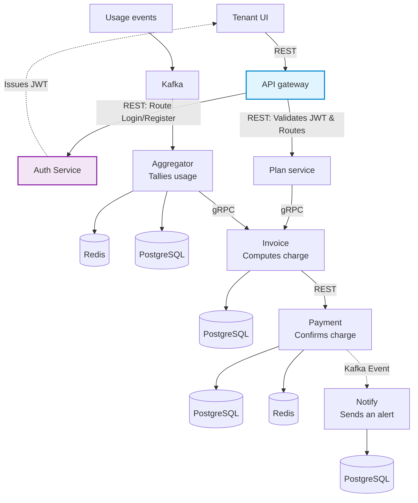

# Architecture — Multi-Tenant SaaS Billing & Subscription Platform

> **Status:** Living Document  
> **Last updated:** June 2026  
> **Build tool:** Maven (multi-module project)  
> **Primary language:** Java 21 (Spring Boot 3.x)  
> **Supplementary:** Python 3.11 (notification-service), React 19 (frontend)

---

## Table of Contents

1. [System Overview](#1-system-overview)
2. [Architecture Diagram](#2-architecture-diagram)
3. [Services — Responsibilities & Tech](#3-services--responsibilities--tech)
4. [Inter-Service Communication](#4-inter-service-communication)
5. [API Gateway — Auth & Authorization](#5-api-gateway--auth--authorization)
6. [Usage Aggregator — Data Flow](#6-usage-aggregator--data-flow)
7. [Data Stores](#7-data-stores)
8. [Key Design Patterns](#8-key-design-patterns)
9. [Maven Multi-Module Structure](#9-maven-multi-module-structure)
10. [Non-Functional Properties](#10-non-functional-properties)

---

## 1. System Overview

This platform is a **backend-first, event-driven billing engine** modeled on how internal
billing systems work at companies like Stripe Billing and Chargebee.

It handles:
- **Subscription lifecycle** — trial → active → past_due → canceled, with full audit trail
- **Usage metering** — near-real-time event ingestion via Kafka, aggregated in Redis + PostgreSQL
- **Invoice generation** — idempotent, scheduled, PDF output
- **Payment processing** — mock Stripe-style gateway with idempotent webhook handling
- **Multi-tenant isolation** — every tenant's data is isolated at the database query level
- **Notifications** — billing events consumed and mock-delivered

The system is **multi-tenant**: each tenant (a company/customer) has isolated billing data,
its own subscription plan, and its own usage quotas.

### Design Philosophy

| Principle | How it's applied |
|---|---|
| **Idempotency everywhere** | Invoice jobs, webhook handlers, and usage writes are all safely retryable |
| **Event-driven consistency** | Kafka decouples producers from consumers; no synchronous coupling on the hot path |
| **Tenant isolation at query level** | `tenant_id` is enforced in every DB query, not just the API layer |
| **Stateless services** | No server-side sessions; JWT carries all identity context |
| **Durability over speed** | Kafka offsets committed only after successful writes; zero data loss on restart |

---

## 2. Architecture Diagram



### Reading the diagram

```
[Tenant UI]
     |
     | REST (JWT in Authorization header)
     v
[API Gateway]  <── The only public-facing port (8080)
     |
     | REST (internal — enriched with X-Tenant-ID, X-User-Role headers)
     |────────────────────────────────────────┐
     v                                        v
[Auth Service]                      [Billing Service]
Issues JWT on login/register        Plans, Subscriptions, State Machine
                                         |
                                  Kafka  | publishes billing-events
                                         v
                                    [Kafka Broker]
                                         |
                          ┌──────────────┴──────────────┐
                          v                             v
               [Usage Aggregator]           [Notification Service]
               Kafka consumer               Python/FastAPI
               Redis (hot totals)           Consumes billing-events
               PostgreSQL (durable)         Mock email / log output

[Invoice Service]
  Triggered by scheduled BillingCycleJob
  Fetches usage    via gRPC ──► Usage Aggregator
  Fetches plan     via gRPC ──► Billing Service
  Triggers payment via REST ──► Payment Service

[Payment Service]
  Mock payment gateway
  Idempotent webhook handler
  Publishes payment events ──► Kafka ──► Notification Service
```

---

## 3. Services — Responsibilities & Tech

### 3.1 API Gateway
| | |
|---|---|
| **Tech** | Java 21, Spring Cloud Gateway, Spring Security |
| **Port** | 8080 (the only port exposed externally) |
| **Responsibilities** | JWT validation, tenant context propagation, route configuration, rate limiting |
| **Does NOT do** | Business logic, DB access |
| **Maven module** | `services/api-gateway` |

### 3.2 Auth Service
| | |
|---|---|
| **Tech** | Java 21, Spring Boot 3.x, Spring Security, PostgreSQL |
| **Port** | 8085 (internal only) |
| **Responsibilities** | User registration, login, JWT signing (HS256), password hashing (BCrypt) |
| **Maven module** | `services/auth-service` |

### 3.3 Billing Service
| | |
|---|---|
| **Tech** | Java 21, Spring Boot 3.x, PostgreSQL, Kafka producer |
| **Port** | 8081 (internal only) |
| **Responsibilities** | Plan catalog CRUD, subscription lifecycle state machine, proration logic, audit logging, publishing billing events to Kafka |
| **State machine** | `TRIALING → ACTIVE → PAST_DUE → CANCELED` |
| **Maven module** | `services/billing-service` |

### 3.4 Usage Aggregator
| | |
|---|---|
| **Tech** | Java 21, Spring Boot 3.x, Kafka consumer (Avro), Redis, PostgreSQL, gRPC server |
| **Port** | 8083 (internal only, gRPC on 9083) |
| **Responsibilities** | Consume usage events from Kafka, atomic INCRBY in Redis, periodic flush to PostgreSQL, serve usage totals via gRPC to Invoice Service |
| **Maven module** | `services/usage-aggregator` |

### 3.5 Invoice Service
| | |
|---|---|
| **Tech** | Java 21, Spring Boot 3.x, OpenPDF/iText, gRPC client, PostgreSQL |
| **Port** | 8082 (internal only) |
| **Responsibilities** | Scheduled billing cycle job, idempotent invoice computation, PDF generation, invoice storage and retrieval |
| **Maven module** | `services/invoice-service` |

### 3.6 Payment Service
| | |
|---|---|
| **Tech** | Java 21, Spring Boot 3.x, PostgreSQL, Kafka producer |
| **Port** | 8084 (internal only) |
| **Responsibilities** | Mock payment gateway, idempotent webhook handler (HMAC-SHA256 verification), retry policy on payment failure, publishing payment events |
| **Maven module** | `services/payment-service` |

### 3.7 Notification Service
| | |
|---|---|
| **Tech** | Python 3.11, FastAPI, kafka-python / confluent-kafka |
| **Port** | 8086 (internal only) |
| **Responsibilities** | Consume `billing-events` Kafka topic, mock-deliver notifications (log output simulating email/SMS) for: invoice generated, payment failed, plan changed, trial ending |
| **Maven module** | N/A — standalone Python service with `pyproject.toml` |

### 3.8 Frontend (Admin Dashboard)
| | |
|---|---|
| **Tech** | React 19, Redux Toolkit, Vite, Tailwind CSS |
| **Port** | 5173 (Vite dev server) |
| **Responsibilities** | Read-mostly admin UI: view tenants, current plans, usage-to-date, invoice history |
| **Maven module** | N/A — standalone Node project |

---

## 4. Inter-Service Communication

| From | To | Protocol | What |
|---|---|---|---|
| Tenant UI | API Gateway | REST / HTTPS | All user-initiated requests |
| API Gateway | Auth Service | REST (internal) | Route `/auth/**` without JWT check |
| API Gateway | Billing Service | REST (internal) | Subscriptions, plans, usage reads |
| API Gateway | Invoice Service | REST (internal) | Invoice list/download |
| API Gateway | Payment Service | REST (internal) | Webhook endpoint |
| Billing Service | Kafka | Kafka produce | Publish `billing-events` topic |
| Usage producers | Kafka | Kafka produce | Publish `usage-events` topic |
| Usage Aggregator | Kafka | Kafka consume | Consume `usage-events` |
| Notification Service | Kafka | Kafka consume | Consume `billing-events` |
| Invoice Service | Usage Aggregator | gRPC | Fetch usage totals at cycle close |
| Invoice Service | Billing Service | gRPC | Fetch plan details at cycle close |
| Invoice Service | Payment Service | REST | Trigger payment charge |
| Payment Service | Kafka | Kafka produce | Publish `payment-events` |

### Kafka Topics

| Topic | Partitions | Schema | Producers | Consumers |
|---|---|---|---|---|
| `usage-events` | 6 | Avro (`UsageEvent.avsc`) | Simulated clients / scripts | Usage Aggregator |
| `billing-events` | 3 | Avro (`BillingEvent.avsc`) | Billing Service, Invoice Service | Notification Service |
| `payment-events` | 3 | Avro (`PaymentEvent.avsc`) | Payment Service | Notification Service, Billing Service |

> **Partition key for `usage-events`:** `tenant_id` — ensures all events for a tenant
> go to the same partition and are processed in order by the aggregator.

---

## 5. API Gateway — Auth & Authorization

### Authentication (Who are you?)

```
1. Client sends:  Authorization: Bearer <JWT>

2. JwtAuthFilter (Global Pre-Filter):
   a. Extract token from header
   b. Verify HMAC-SHA256 signature (shared secret from env)
   c. Check `exp` claim (expired? reject)
   d. FAIL → 401 Unauthorized (request stops here, never hits downstream)
   e. PASS → decode claims: { sub, tenant_id, role }

3. TenantContextFilter enriches the forwarded request:
   X-Tenant-ID:  <tenant_id from JWT>
   X-User-Role:  <role from JWT>
   X-User-ID:    <sub from JWT>

4. Gateway routes to downstream service.
```

**Special case:** `/auth/**` routes bypass JWT validation entirely.
This is the only path that doesn't require a token (it's how you GET a token).

### Authorization (What can you do?)

**Layer 1 — Gateway (coarse, route-based):**
```
Route /admin/**  →  require X-User-Role == PLATFORM_ADMIN
                    else → 403 Forbidden
```

**Layer 2 — Downstream service (fine-grained, query-based):**
```java
// Every DB query in billing-service is scoped to tenant:
repo.findByIdAndTenantId(subscriptionId, tenantId);
//                        ^^^^^^^^^^^^^^^^^^^^
//                        tenantId from X-Tenant-ID header
//                        A valid token for Tenant A CANNOT read Tenant B's data
```

This two-layer approach is the multi-tenant isolation guarantee.
Even a compromised token cannot cross tenant boundaries because the DB query
enforces `tenant_id` at the data layer.

### JWT Structure

```json
{
  "sub":       "550e8400-e29b-41d4-a716-446655440000",
  "tenant_id": "tenant-abc-123",
  "role":      "TENANT_ADMIN",
  "iat":       1719481200,
  "exp":       1719567600
}
```

Roles: `TENANT_ADMIN` | `PLATFORM_ADMIN`

---

## 6. Usage Aggregator — Data Flow

### Write Path (Event Ingestion)

```
[Client / Script]
  Emits: { tenant_id, metric, quantity, timestamp, event_id }
        |
        | Kafka produce (Avro serialized)
        v
[Kafka: usage-events topic, partitioned by tenant_id]
        |
        | @KafkaListener (manual offset commit)
        v
[UsageEventConsumer.java]
  1. Deserialize Avro → UsageEvent POJO
  2. Deduplication check: SISMEMBER dedup:{event_id} in Redis
     - Duplicate? → skip, log, commit offset
     - New? → continue
        |
        v
[AggregationService.java]
  Redis INCRBY:
    Key:  usage:{tenant_id}:{billing_cycle}:{metric}
    Cmd:  INCRBY usage:tenant-abc:2026-06:api_calls 15
    TTL:  set to end of billing cycle
        |
        | (async, every 30 seconds)
        v
[FlushService.java]
  Scan Redis keys: usage:*
  Upsert into PostgreSQL: usage_totals table
  This is the durable record — survives Redis restart
        |
        v
  Commit Kafka offset (only after successful write)
```

**Why this ordering matters:**
Offset is committed ONLY after the Redis write succeeds.
If the service crashes between consuming and writing, the event is re-delivered.
The deduplication check (Step 2) prevents double-counting on re-delivery.
Result: **effectively exactly-once semantics**.

### Read Path (UI / Invoice Service)

```
[Tenant UI] → GET /usage/current → [API Gateway] → [Billing Service read endpoint]
  → Check Redis first (sub-millisecond, hot data)
  → Fall back to PostgreSQL (if Redis miss / cold start)
  → Return: { metric: "api_calls", total: 4750, quota: 10000, overage: false }

[Invoice Service] → gRPC GetUsageTotals(tenant_id, billing_cycle_id)
  → [Usage Aggregator gRPC server]
  → Reads from PostgreSQL (authoritative at cycle close time)
  → Returns: { api_calls: 12450, storage_gb: 87.3 }
```

---

## 7. Data Stores

### PostgreSQL (Primary Durable Store)

Each service owns its own **schema** (logical isolation within the same PostgreSQL instance for local dev; separate instances in production):

| Schema | Service | Key Tables |
|---|---|---|
| `auth` | Auth Service | `users` |
| `billing` | Billing Service | `plans`, `plan_versions`, `subscriptions`, `audit_logs` |
| `usage` | Usage Aggregator | `usage_totals`, `usage_events_raw` (optional archive) |
| `invoice` | Invoice Service | `invoices`, `invoice_line_items` |
| `payment` | Payment Service | `payment_attempts`, `idempotency_keys`, `webhook_events` |
| `notification` | Notification Service | `notification_log` |

> **No shared tables across services.** If Service A needs data from Service B,
> it calls Service B's API or reads from a Kafka event. This enforces service boundaries.

### Redis

Used by Usage Aggregator only:
- **Hot usage totals:** `usage:{tenant_id}:{cycle}:{metric}` → integer counter
- **Deduplication set:** `dedup:{event_id}` → exists or not (TTL: 7 days)

### Kafka

Event backbone. See Topic table in Section 4.
Avro schemas are the **single source of truth** — stored in `shared/src/main/avro/`.

---

## 8. Key Design Patterns

### Idempotency

| Where | How |
|---|---|
| Invoice generation | Check for existing invoice with same `(tenant_id, billing_cycle_id)` before computing |
| Webhook handling | Store `webhook_event_id` in `idempotency_keys` table with UNIQUE constraint. Duplicate → 200 OK, no processing |
| Usage aggregation | Dedup `event_id` in Redis SET before INCRBY |

### Subscription State Machine

```
TRIALING ──(trial ends)──────────────────► ACTIVE
TRIALING ──(payment fails on trial end)──► PAST_DUE
ACTIVE   ──(payment fails)───────────────► PAST_DUE
PAST_DUE ──(payment succeeds on retry)──► ACTIVE
PAST_DUE ──(all retries exhausted)──────► CANCELED
ACTIVE   ──(tenant cancels)─────────────► CANCELED
```

Every transition is written to `audit_logs` with: `tenant_id`, `from_state`, `to_state`,
`reason`, `triggered_by`, `created_at`. This table is append-only — never updated.

### Proration on Upgrade

```
Proration credit = (days remaining in cycle / total days in cycle) × old plan price
Charge on upgrade = new plan price − proration credit
Applied immediately on upgrade; downgrade takes effect at next cycle.
```

### Retry Policy on Payment Failure

```
Attempt 1: Day 0  (invoice due date)
Attempt 2: Day 3
Attempt 3: Day 5
After 3 failures: subscription → CANCELED
Each attempt publishes payment.failed event → Notification Service
```

---

## 9. Maven Multi-Module Structure

The project uses **Maven multi-module** as the build system.
All Java services are Maven submodules coordinated from the root `pom.xml`.
The Python notification service and React frontend manage their own dependencies separately.

```
saas-billing-platform/
|── pom.xml                    ← Root POM (parent, manages shared dependency versions)
|
|── shared/                    ← Shared library module
|   └── pom.xml                ← packaging: jar, depended on by all Java services
|
|── services/
|   |── api-gateway/
|   |   └── pom.xml            ← parent: root pom, depends on: shared
|   |── auth-service/
|   |   └── pom.xml
|   |── billing-service/
|   |   └── pom.xml
|   |── usage-aggregator/
|   |   └── pom.xml
|   |── invoice-service/
|   |   └── pom.xml
|   └── payment-service/
|       └── pom.xml
|
|── services/notification-service/   ← Python — NOT a Maven module
|   └── pyproject.toml
|
└── frontend/                        ← React — NOT a Maven module
    └── package.json
```

### Root POM responsibilities
- Define `<dependencyManagement>` with pinned versions for:
  Spring Boot, Spring Cloud, Kafka client, Avro, gRPC, PostgreSQL driver, Lombok, MapStruct, etc.
- Define `<pluginManagement>` for: maven-compiler-plugin (Java 21), spring-boot-maven-plugin,
  avro-maven-plugin, protobuf-maven-plugin
- List all Java submodules in `<modules>`

### Shared module
Contains:
- Avro schemas (`src/main/avro/`) — compiled to Java classes by `avro-maven-plugin`
- Protobuf definitions (`src/main/proto/`) — compiled by `protobuf-maven-plugin`
- Shared DTOs, common exceptions, `JwtClaimsUtil.java`

Every Java service adds this dependency:
```xml
<dependency>
    <groupId>com.billing</groupId>
    <artifactId>shared</artifactId>
    <version>${project.version}</version>
</dependency>
```

### Build Commands

```bash
# Build everything (from root)
mvn clean install

# Build a single service (skips others)
mvn clean install -pl services/billing-service -am

# Run tests only
mvn test

# Run a specific service locally
mvn spring-boot:run -pl services/api-gateway

# Skip tests (faster iteration)
mvn clean install -DskipTests
```

---

## 10. Non-Functional Properties

### Scalability
- **Usage ingestion path:** Stateless Kafka consumer — add more instances to the
  `usage-aggregator` consumer group to scale horizontally. Kafka distributes partitions across consumers.
- **API path:** All Java services are stateless (no session state). Add instances behind a load balancer.
- **25k+ user target:** Redis handles 100k+ ops/sec. Kafka handles millions of events/sec.
  PostgreSQL with connection pooling (HikariCP) handles concurrent reads/writes.
  The bottleneck will be the DB — mitigate with read replicas for reporting queries.

### Observability
- **Structured logging:** JSON log format (Logback + logstash-logback-encoder) on all Java services
- **Correlation IDs:** `X-Correlation-ID` header propagated from Gateway through all services,
  added to MDC for inclusion in every log line
- **Health endpoints:** Spring Boot Actuator `/actuator/health` on all Java services
- **Kafka monitoring:** Kafka UI (AKHQ) running in Docker for local dev — visualize topics, consumer lag

### Resilience
- **Kafka consumer group failover:** If one aggregator instance dies, Kafka reassigns its
  partitions to remaining instances within the consumer group.
- **Redis failover:** If Redis goes down, the aggregator queues writes and flushes when Redis recovers.
  PostgreSQL remains the authoritative store — no data is lost.
- **Idempotent retries:** All critical operations can be safely retried without side effects.

### Security
- JWT signed with HS256, secret stored in environment variable (never hardcoded)
- Webhook signatures verified with HMAC-SHA256 (simulated Stripe signature pattern)
- Passwords hashed with BCrypt (cost factor 12)
- Tenant data isolation enforced at query level — SQL always includes `WHERE tenant_id = ?`
- All inter-service communication is internal (no external exposure of service ports)

---

*See [PROJECT_GUIDE.md](./PROJECT_GUIDE.md) for step-by-step build instructions.*  
*See [DECISIONS.md](./DECISIONS.md) for Architecture Decision Records (to be created as decisions are made).*
