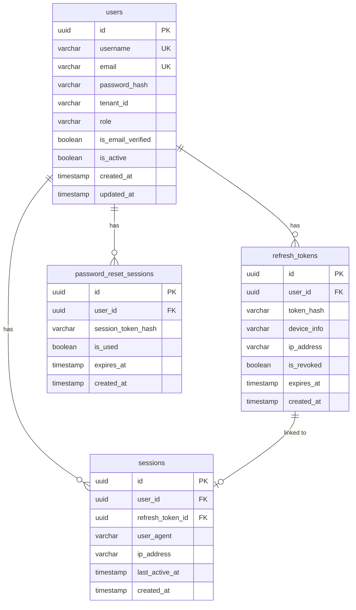

# Data Model — Auth Service

> Designed by the developer after R&D.
> Covers: PostgreSQL schema, Redis key design, ERDs, and the Forgot Password flow.
> This document is the source of truth for all tables and keys owned by the `auth` schema.

---

## Design Philosophy — What Lives Where

| Data Type | Storage | Reason |
|---|---|---|
| User identity, sessions, tokens | PostgreSQL | Permanent, relational, needs ACID |
| OTPs, rate limits, JWT blacklist | Redis | Temporary, auto-expiry, fast |

---

## Redis Design

### Why Redis for OTPs

Think of Redis like a **whiteboard with a timer**. You write something on it, set a countdown, and it erases itself automatically. PostgreSQL is a filing cabinet — great for permanent records, overkill for a 10-minute OTP.

| Concern | PostgreSQL | Redis |
|---|---|---|
| Auto-expiry | You query `expires_at > NOW()` manually | TTL built-in, key deletes itself |
| Speed | Disk-based, slower | In-memory, microseconds |
| Cleanup job needed | Yes, old rows pile up | No, Redis handles it |
| OTP attempt count | Extra column + update query | `INCR` command, atomic |
| Right tool for temp data | No | Yes |

### Redis Key Reference Table

| Key | Value | TTL | Purpose |
|---|---|---|---|
| `otp:pwd_reset:{userId}` | bcrypt hash of OTP | 10 min | Password reset OTP |
| `otp:pwd_reset:{userId}:attempts` | integer count | 10 min | Wrong attempt counter |
| `otp:email_verify:{userId}` | bcrypt hash of OTP | 24 hrs | Email verification OTP |
| `otp:email_verify:{userId}:attempts` | integer count | 24 hrs | Wrong attempt counter |
| `rate_limit:{userId}:otp` | `1` | 2 min | Resend throttle (NX flag) |
| `blacklist:access:{jti}` | `1` | remaining JWT lifetime | Logout / token revocation |

Consistent prefix pattern (`otp:`, `rate_limit:`, `blacklist:`) makes it easy to scan, debug, and set different eviction policies per prefix if needed.

### How Each Key Works

**OTP storage** — Stored as a bcrypt hash (never raw). On resend, same key is overwritten.
```
SET otp:pwd_reset:{userId}  "$2a$10$hashedOtpHere"  EX 600
```

**Attempt counter** — INCR is atomic. No race conditions.
```
INCR otp:pwd_reset:{userId}:attempts   ← each wrong attempt
GET  otp:pwd_reset:{userId}:attempts   ← check if >= 5
```

**Rate limiter** — NX = only set if key does NOT exist.
```
SET rate_limit:{userId}:otp  1  EX 120  NX
```
- First request within 2 min → key doesn't exist → allow
- Second request within 2 min → key exists → 429 Too Many Requests

**JWT blacklist** — Stores the `jti` (JWT ID) of a logged-out token. TTL = exact remaining seconds on the JWT so no memory is wasted.
```
SET blacklist:access:{jti}  1  EX {remaining_seconds}
```

---

## PostgreSQL Schema (`auth` schema)

> ⚠️ **Note:** `password_reset_otps` and `email_verification_otps` tables do NOT exist.
> Redis owns all OTP data. PostgreSQL only holds permanent records.

```sql
-- Core identity
CREATE TABLE users (
    id                UUID         PRIMARY KEY DEFAULT gen_random_uuid(),
    username          VARCHAR(50)  NOT NULL UNIQUE,
    email             VARCHAR(255) NOT NULL UNIQUE,
    password_hash     VARCHAR(255) NOT NULL,
    tenant_id         VARCHAR(100) NOT NULL,           -- Multi-tenant: which tenant this user belongs to
    role              VARCHAR(50)  NOT NULL,            -- 'PLATFORM_ADMIN' or 'TENANT_ADMIN'
    is_email_verified BOOLEAN      NOT NULL DEFAULT FALSE,
    is_active         BOOLEAN      NOT NULL DEFAULT TRUE,
    created_at        TIMESTAMP    NOT NULL DEFAULT NOW(),
    updated_at        TIMESTAMP    NOT NULL DEFAULT NOW()
);

-- Long-lived login tokens, one per device
CREATE TABLE refresh_tokens (
    id           UUID         PRIMARY KEY DEFAULT gen_random_uuid(),
    user_id      UUID         NOT NULL REFERENCES users(id),
    token_hash   VARCHAR(255) NOT NULL,
    device_info  VARCHAR(255),
    ip_address   VARCHAR(50),
    is_revoked   BOOLEAN      NOT NULL DEFAULT FALSE,
    expires_at   TIMESTAMP    NOT NULL,
    created_at   TIMESTAMP    NOT NULL DEFAULT NOW()
);

-- Active login sessions (one per device per user)
CREATE TABLE sessions (
    id               UUID         PRIMARY KEY DEFAULT gen_random_uuid(),
    user_id          UUID         NOT NULL REFERENCES users(id),
    refresh_token_id UUID         NOT NULL REFERENCES refresh_tokens(id),
    user_agent       VARCHAR(500),
    ip_address       VARCHAR(50),
    last_active_at   TIMESTAMP    NOT NULL DEFAULT NOW(),
    created_at       TIMESTAMP    NOT NULL DEFAULT NOW()
);

-- Issued after OTP verified — gates the actual password change
CREATE TABLE password_reset_sessions (
    id                 UUID         PRIMARY KEY DEFAULT gen_random_uuid(),
    user_id            UUID         NOT NULL REFERENCES users(id),
    session_token_hash VARCHAR(255) NOT NULL,
    is_used            BOOLEAN      NOT NULL DEFAULT FALSE,
    expires_at         TIMESTAMP    NOT NULL,  -- 15 minutes
    created_at         TIMESTAMP    NOT NULL DEFAULT NOW()
);
```

### ERD — PostgreSQL



---

## Forgot Password Flow

**Step 1** — `POST /auth/forgot-password` → body: `{ username }`
- Look up user by username → get their email
- Generate 6-digit OTP → hash it → store in Redis with 10 min TTL
- Send OTP to user's email
- Response: `{ message: "OTP sent" }` — never reveal the email in response

**Step 2** — `POST /auth/verify-otp` → body: `{ username, otp }`
- Fetch `otp:pwd_reset:{userId}` from Redis
- Hash submitted OTP → compare with stored hash
- If wrong: `INCR` attempts counter → if `>= 5` delete both keys (force resend)
- If correct: delete both keys → generate `reset_session_token` → store hash in `password_reset_sessions` (15 min)
- Response: `{ reset_session_token: "raw-token" }`

**Step 3** — `POST /auth/reset-password` → body: `{ reset_session_token, new_password }`
- Look up `password_reset_sessions` by token hash → verify not used and not expired
- Hash new password → `UPDATE users SET password_hash = ?`
- Mark session token as `is_used = true`
- Revoke all refresh tokens for this user (force logout everywhere)
- Response: `{ message: "Password updated" }`
